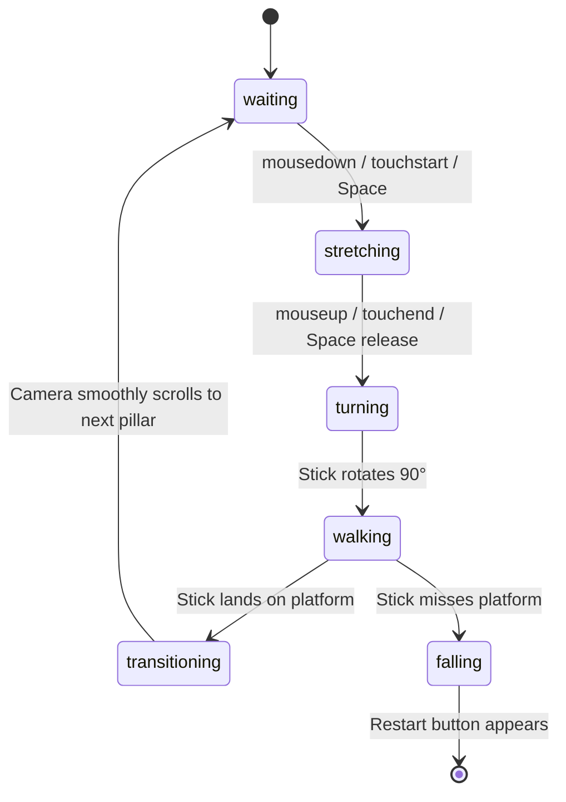

# 🏃 Stick Hero (Stick Man) Canvas Game

<div align="center">


**A classic, physics-inspired stick hero arcade game created using HTML5 Canvas & Vanilla JavaScript.**

[🎮 Play Live Demo](#-how-to-play) • [✨ Key Features](#-features) • [🚀 Quick Start](#-quick-start) • [📐 How It Works](#-technical-architecture)

</div>

---

## 📸 Screenshots & Gameplay

<div align="center">

### 🕹️ 1. Waiting at the Edge
*Hold down the mouse, spacebar, or tap on mobile to stretch out the stick.*


---

### 📏 2. Precision Stretching
*Gauge the distance to the next pillar. If the stick is too short or too long, your stick hero falls!*


---

### 🚶 3. Crossing the Bridge
*Land directly in the red center zone of the target platform for a **DOUBLE SCORE** bonus!*


---

### 💥 4. Game Over & Instant Restart
*One click or spacebar tap immediately restarts the game.*


</div>

---

## ✨ Features

- **🎯 Physics & Math-based Calculations**:
  - Smooth trigonometric wave generations for background hills and procedural tree distributions.
  - Angular stick rotation (90° lowering physics, 180° falling animations).
- **🔴 Perfect Hit Scoring System**:
  - Hitting the center red target zone rewards **DOUBLE POINTS** with visual badge feedback.
- **📱 Fully Responsive & Cross-Platform**:
  - Full viewport canvas scaling that dynamically adapts on browser resize.
  - Full touch controls supported on mobile phones and tablets (`touchstart`, `touchend`).
  - Desktop controls via mouse buttons and **Spacebar**.
- **💾 Local High Score Tracking**:
  - Automatically preserves best runs in browser `localStorage`.
- **⚡ Lightweight & Zero-Dependency**:
  - Built with pure HTML5 Canvas and Vanilla JavaScript.
  - No external build steps, no bulky dependencies — instant load times.

---

## 🎮 How to Play

| Control | Action |
| :--- | :--- |
| **Mouse Left-Click (Hold)** | Grow stick upwards |
| **Mouse Left-Click (Release)** | Drop stick onto next platform |
| **Spacebar (Hold & Release)** | Keyboard alternative to stretch and drop |
| **Touch Screen (Hold & Release)**| Stretch and drop on mobile / tablet devices |
| **Restart Button / Spacebar** | Instantly restart when game ends |

### 🏆 Pro Tips
1. **Patience is Key**: Sticks grow at a steady rate of 1 pixel every 4 milliseconds.
2. **Aim for the Red Target**: Hitting the center red spot doubles the earned score.
3. **Overstretching is Fatal**: A stick that exceeds the platform's far edge will result in falling into the abyss.

---

## 🚀 Quick Start

### Option 1: Direct in Browser
Simply clone or download this repository, and open `index.html` in any modern web browser:

```bash
git clone https://github.com/Sunil56224972/stick-man.git
cd stick-man
```

Double click `index.html` or open it with your browser!

### Option 2: Local Development Server

Run with Node.js built-in server:

```bash
# Clone the repository
git clone https://github.com/Sunil56224972/stick-man.git
cd stick-man

# Start local server
npm start
```

Then visit [http://localhost:8089](http://localhost:8089) in your web browser.

---

## 📂 Project Structure

```text
stick-man/
├── index.html        # Main HTML5 entry point with responsive viewport
├── style.css         # Clean UI styling, restart buttons, animations
├── script.js         # Canvas rendering engine, state machine, and game physics
├── package.json      # Node script and metadata
├── server.js         # Zero-dependency local development server
├── .gitignore        # Standard ignore rules
├── screenshots/      # Gameplay screenshots for documentation
│   ├── gameplay.png
│   ├── stretching.png
│   ├── walking.png
│   └── gameover.png
└── README.md         # Professional documentation
```

---

## 📐 Technical Architecture

The game is built around a finite state machine loop powered by `requestAnimationFrame`:



---

## 🤝 Contributing

Contributions, issues, and feature requests are welcome!
Feel free to check [issues page](https://github.com/Sunil56224972/stick-man/issues).

1. Fork the Project
2. Create your Feature Branch (`git checkout -b feature/AmazingFeature`)
3. Commit your Changes (`git commit -m 'Add some AmazingFeature'`)
4. Push to the Branch (`git push origin feature/AmazingFeature`)
5. Open a Pull Request

---

## 📜 License

This project is licensed under the MIT License - feel free to use and customize for your own projects!

---

<div align="center">
Made with ❤️ by <a href="https://github.com/Sunil56224972">Sunil</a>
</div>
