# Stick Hero

A hand-drawn arcade bridge game. Hold to grow a stick, release to drop it, and walk across. Miss the gap and you fall. Play solo, race a friend 1 vs 1, or run a party of up to four on the same course in real time. Built with plain HTML5 Canvas, vanilla JavaScript and a dependency-free Node server: no frameworks, no bundler, no build step.


## Features

- Hold-and-release bridge mechanic with a difficulty curve that tightens gaps and narrows pillars as your score climbs.
- Mid-walk gravity flip: tap while crossing a gap to hang under the stick and grab cherries.
- Perfect drops on the red target pillar marker, with a combo multiplier.
- Armory with 6 heroes and 6 stick styles, each with a rarity tier, all drawn in code (no image assets).
- 12 feats that pay out cherries, a Records tab with lifetime stats, and a daily gift with a streak bonus.
- Six maps, each with its own sky, three-layer parallax scenery, pillar material and weather: Pine Meadow (fireflies), Sakura Shrine (petals), Dune Canyon (dust), Frozen Peaks (snow and aurora), Neon Harbor (rain and a lit skyline) and Ember Caldera (embers). Every map blends day, dusk and night as your score climbs, and the armory previews cycle through all three.
- Online races, 1 vs 1 or a party of up to four players: create a room, share a 4-letter code or an invite link, pick a map and race the same course while watching every rival's run live on your own screen. See [Multiplayer](#multiplayer).
- Fully synthesised soundtrack of effects, no audio files: a creaking bamboo stick that rises in pitch as it grows, wood-on-stone knocks, soft sandal footsteps locked to the leg animation, taiko impacts and koto-style plucks. Everything is tuned to one pentatonic scale, perfect combos climb it, and a temple bell marks dusk and night. Mute with the speaker button or `M`.
- Fully responsive: phones in portrait and landscape, tablets, laptops and ultrawide monitors. Safe-area insets keep the HUD clear of notches, cards scroll instead of clipping on short screens, and tap targets stay thumb-sized.
- Works with mouse, touch and keyboard.
- Versioned save in `localStorage`, with migration from the previous release's keys.

## Screenshots

| Growing a bridge | Gravity flip | Perfect drop |
| --- | --- | --- |
|  |  |  |

| Armory: heroes | Armory: sticks | Records and feats |
| --- | --- | --- |
|  |  |  |

| Pause | Game over | Phone |
| --- | --- | --- |
|  |  |  |

### Responsive

| Phone, landscape | Landscape game over | Landscape armory | Tablet |
| --- | --- | --- | --- |
| 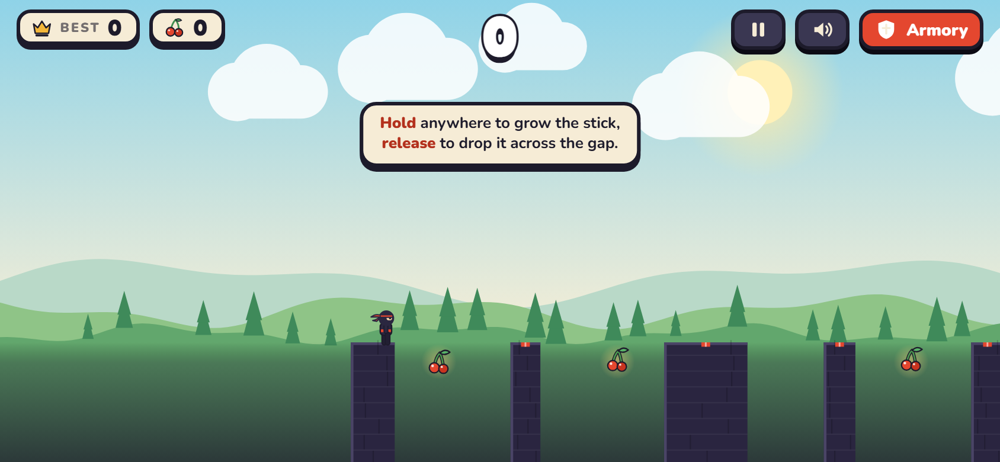 | 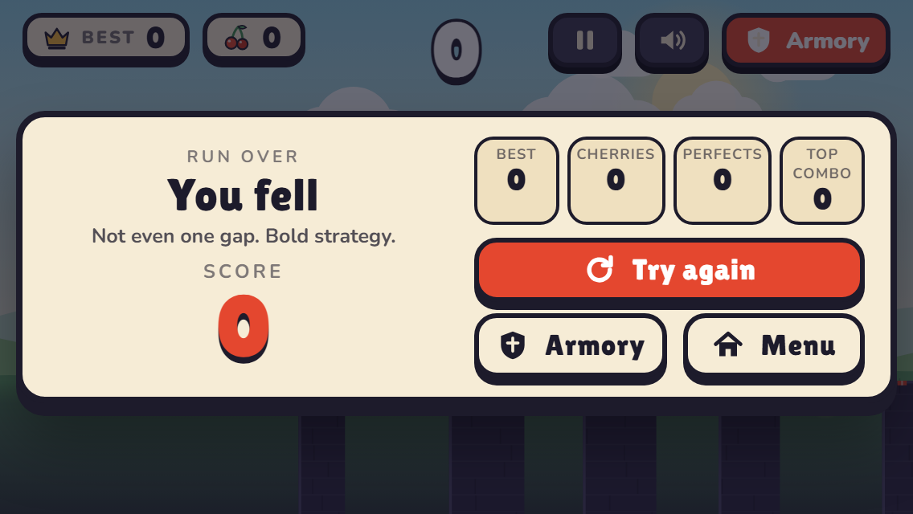 | 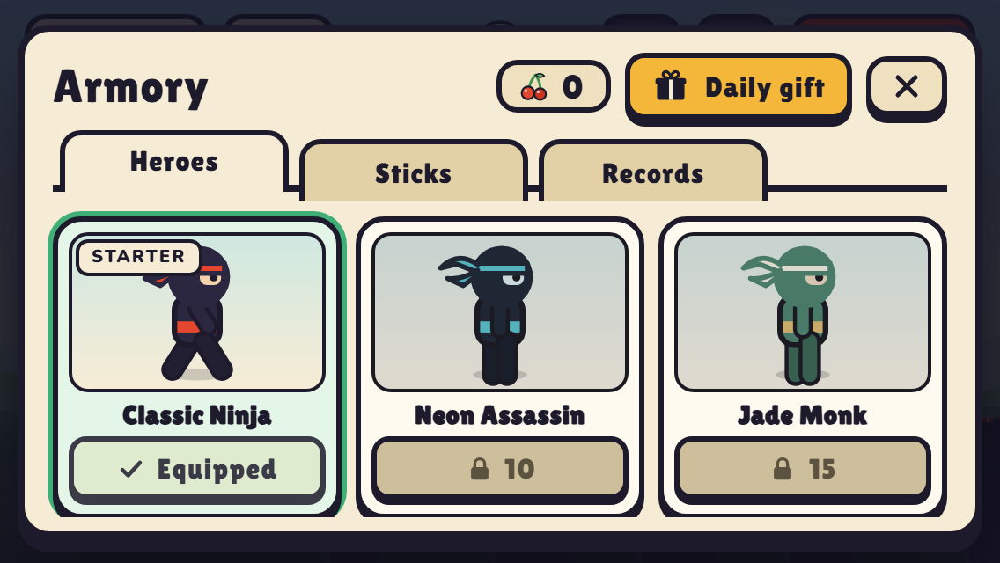 | 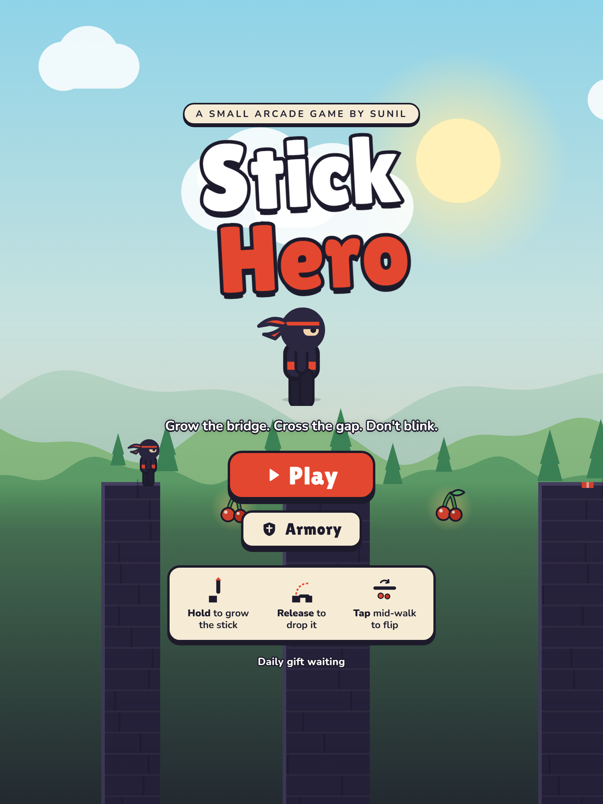 |

### Maps

| Pine Meadow | Sakura Shrine | Dune Canyon |
| --- | --- | --- |
| 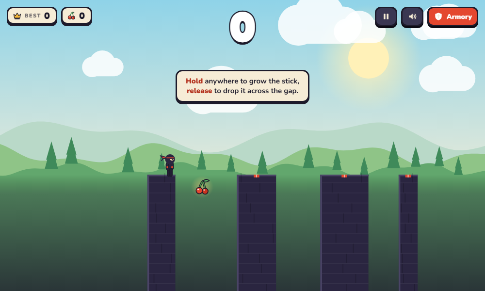 | 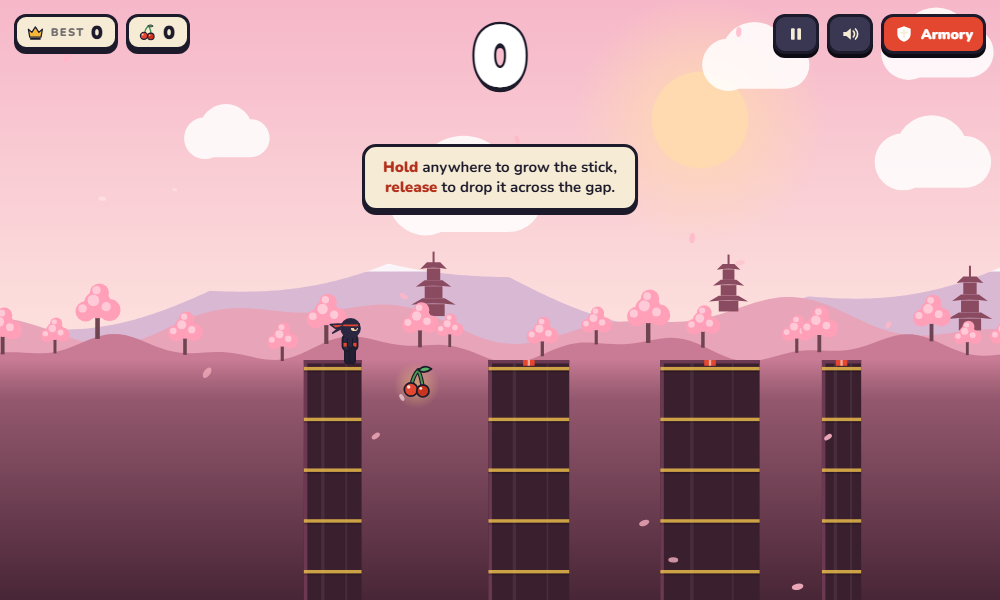 | 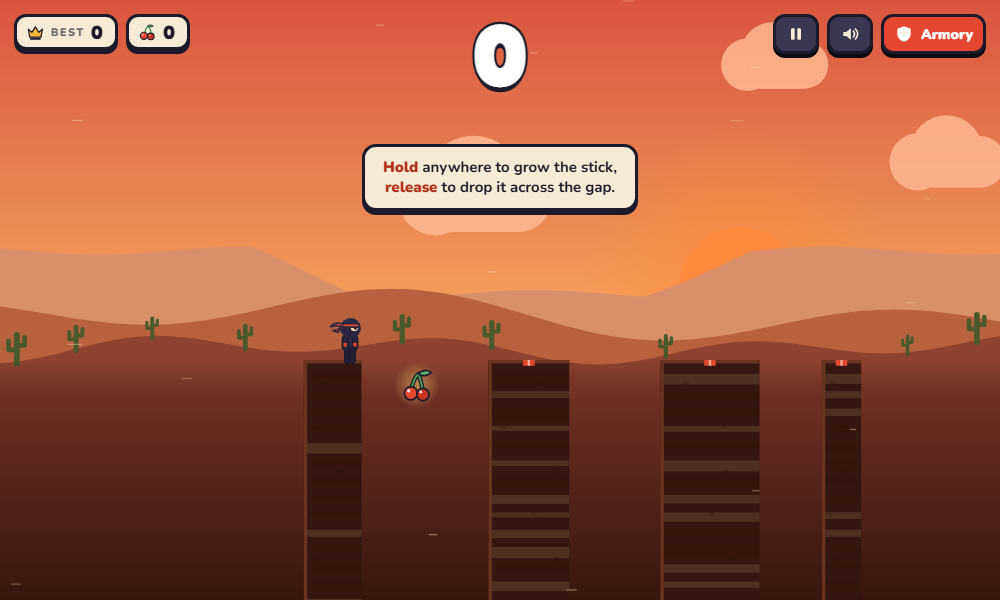 |

| Frozen Peaks | Neon Harbor | Ember Caldera |
| --- | --- | --- |
| 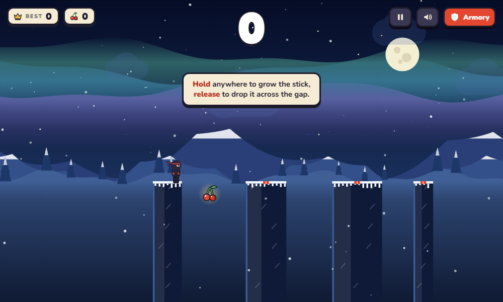 | 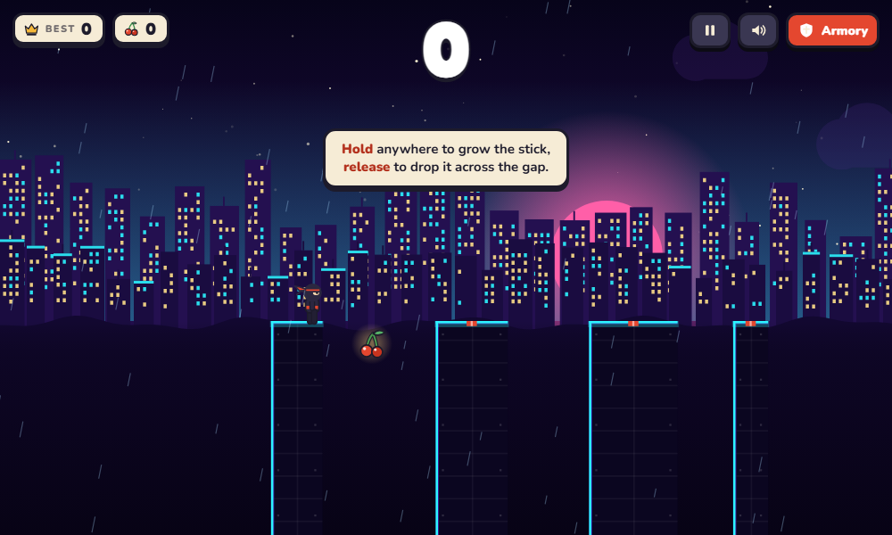 | 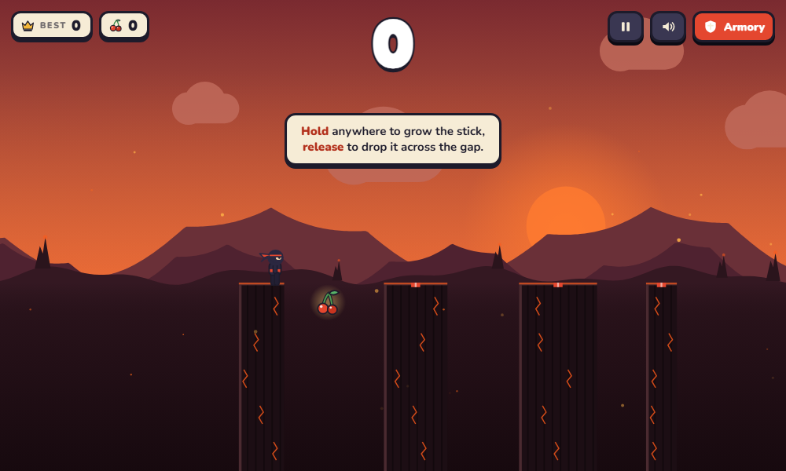 |

Maps are bought with cherries in the armory's Maps tab and apply to the next frame you play. Pine Meadow is free.

## Multiplayer

Press **Friends** on the title screen.

1. One player enters a name, picks **1 vs 1** (two seats) or **Party** (up to four) and taps **Create a room**. The lobby shows a 4-letter code and a **Copy link** button.
2. Friends open the invite link (`?room=ABCD`) or type the code under **or join a friend**. A full room turns new players away.
3. The host picks the map. Everyone else taps **I'm ready**, then the host taps **Start race**.
4. A 3-2-1 countdown plays, then everyone races the **same seeded course** on their own screen. A strip under the score shows live standings, and a small live panel for every other racer replays their run as it happens: their hero, their bridge, their score. Anyone who falls is greyed out.
5. When the last player is out the results card ranks everyone by score. A tie goes to whoever stopped scoring first. **Rematch** returns the room to the lobby.

| Lobby | Lobby on a phone |
| --- | --- |
| 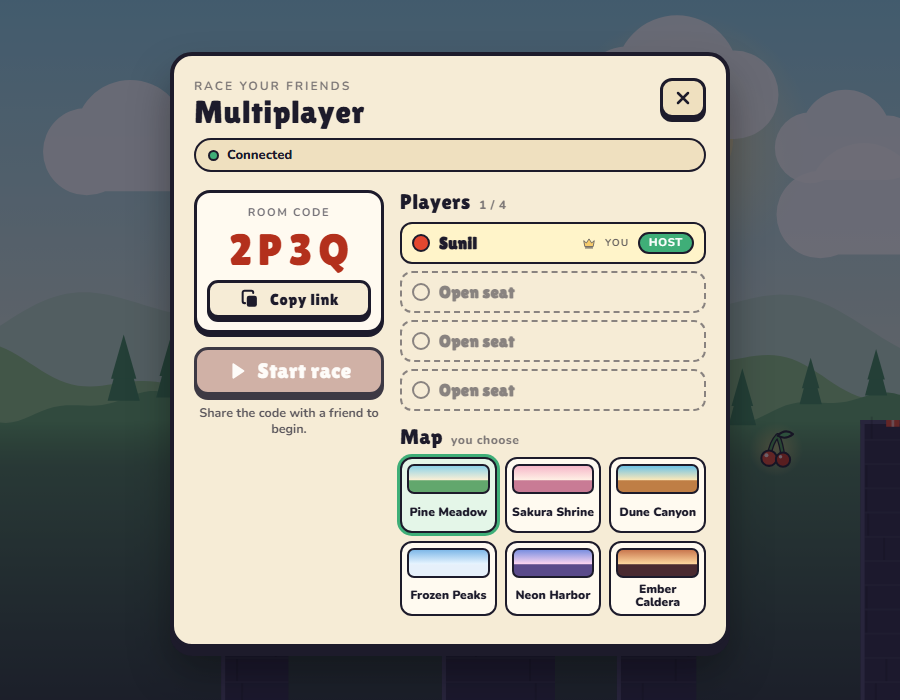 | 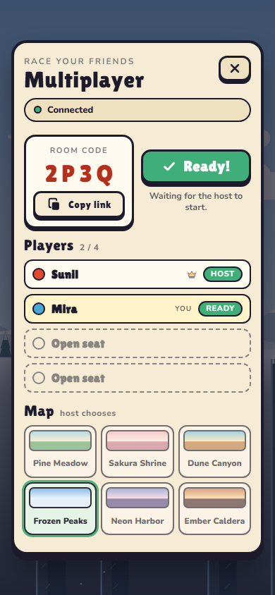 |

| Race, with the rival's live panel | Race on a phone | Results |
| --- | --- | --- |
| 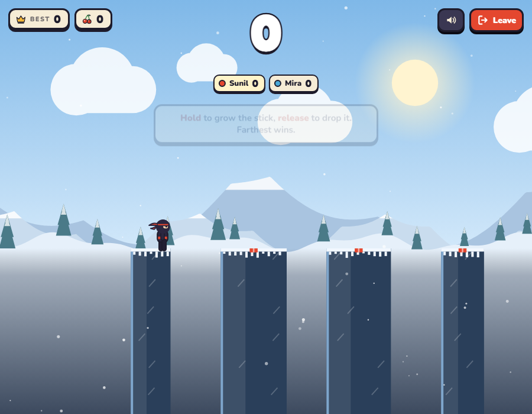 | 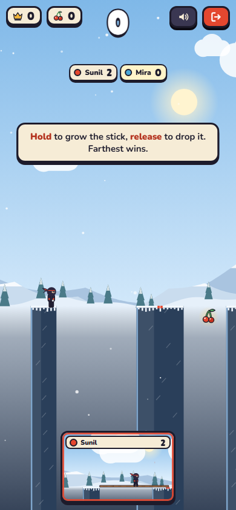 | 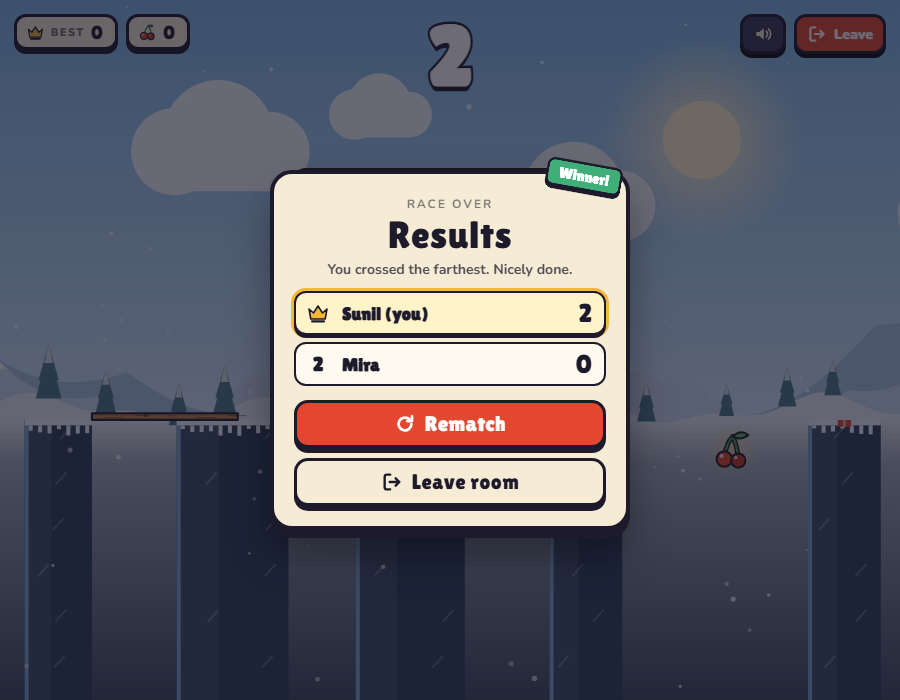 |

Race rules differ slightly from solo play so that it stays fair:

- The course is generated from a shared seed, one platform at a time, and its difficulty follows the platform number rather than your score. Everyone faces identical gaps, widths and cherries, however well they play.
- A race never pauses. Losing focus only releases the stick, and **Esc** or **Leave** opens a confirm prompt while the race keeps running.
- Race results do not touch your solo best, stats or cherries.
- Maps are cosmetic in a room: everyone sees the host's choice whether or not they own it.
- Live panels show each rival in the hero and stick they have equipped.

### Hosting it

Multiplayer needs a server process, because browsers cannot connect to each other directly. `npm start` runs one: it serves the game and the WebSocket endpoint at `/ws` from the same port, so friends on your network (or through a tunnel such as `ngrok`) can play with nothing else to set up.

The live deployment is split in two:

- **Vercel** serves the static game from `public/`. This is the link players open.
- **Render** runs `server.js`, which hosts the rooms. It was created from the included [`render.yaml`](render.yaml) blueprint (**New > Blueprint**, pick this repo) and exposes `/health` for its health check.

[`public/js/config.js`](public/js/config.js) tells the static site where the rooms live:

```js
window.SH_CONFIG = { server: 'https://stick-man-djpy.onrender.com' };
```

Friends only need the Vercel link: they tap **Friends** and the page connects to Render on its own. Free Render instances sleep when idle, so the first connection after a quiet spell can take up to 30 seconds; the lobby says so while it waits. Pushing to `main` redeploys both hosts, and a multiplayer change is live once both have finished.

Any Node host with WebSocket support works in place of Render (Railway, Fly.io, a VPS). Leave `server` empty when one Node process serves both the page and the rooms. On `localhost` the setting is ignored and the page always talks to its own server, so local development never touches the live rooms. A `?server=host:port` query parameter overrides everything for testing. When the server cannot be reached, the lobby says so and offers a retry, and solo play keeps working.

### How it works

`server/ws.js` is a small RFC 6455 WebSocket server (handshake, masked frames, fragmentation, ping/pong, a 4 KB payload cap, heartbeat). `server/rooms.js` holds the room rules and has no I/O of its own, so it is unit-tested with a fake clock. Messages are one JSON object each, `{"t": "<type>", ...}`.

| Client to server | Purpose |
| --- | --- |
| `create`, `join` | Make a room, or enter one by code. |
| `ready`, `map`, `start`, `again` | Lobby actions. Only the host can use `map` and `start`. |
| `score` | `{score, n}`: current score and bridges crossed. |
| `view` | This player's live snapshot, about 20 a second. |
| `dead`, `leave`, `ping` | Fell out, left, keep-alive. |

| Server to client | Purpose |
| --- | --- |
| `joined`, `room` | Full room snapshot: players, ready flags, host, map. |
| `countdown`, `go` | Start sequence. `countdown` carries the shared seed. |
| `score`, `out` | Live standings. |
| `view` | Another racer's live snapshot (phase, hero position, stick, score), relayed up to 25 times a second. |
| `results`, `notice`, `err` | Final ranking and messages. |

Live panels do not stream video. Each device sends a tiny snapshot of its own run, and every other device replays it in a small canvas using the same game simulation (a read-only `ghost`), so the motion stays smooth between snapshots and costs a few kilobytes a second. The server only copies known numeric fields, clamps their ranges and throttles the rate.

The server is authoritative for the room: who is in it, who is ready, when the race starts and who won. It does not run the physics, so it sanity-checks what clients report. A score is accepted only if it is possible for the number of bridges claimed (`score <= n x (n+1)`) and the time elapsed since the start (one bridge takes at least 0.6 s). Names are stripped to letters, digits and a few symbols, messages are rate limited, and a silent player is counted out after 45 s. If the host leaves, the next player becomes host.

Because scoring is client-reported, this is built for friends, not competitive integrity: a determined cheater could still report a believable score.

## Controls

| Action | Mouse / touch | Keyboard |
| --- | --- | --- |
| Grow the stick | Press and hold | Hold `Space` or `Enter` |
| Drop the stick | Release | Release `Space` or `Enter` |
| Flip while crossing | Click or tap | `Space` or `Enter` |
| Pause / resume | Pause button | `P` or `Esc` |
| Mute / unmute | Speaker button | `M` |
| Open the armory | Armory button | `A` |
| Leave a race | Leave button | `Esc` |

## Rules

- A landing scores 1 point. A perfect drop (stick tip on the red marker) scores `combo x 2`, and the combo grows with each consecutive perfect.
- Flipping is only allowed while you are over a gap. Arriving at a pillar upside down crashes into it.
- Cherries hang beneath wide gaps (80 px or more). You can only collect them while flipped.
- The sky changes at scores 10 (dusk) and 20 (night) on every map.
- The daily gift pays 10 cherries plus 2 per streak day, capped at 22.

## Run locally

Requires Node.js 18 or newer. There are no dependencies to install.

```bash
npm start
```

Then open <http://localhost:8089>. The server serves the `public/` folder (rejecting path traversal) and the multiplayer endpoint. Solo play also works from any static host, since the game is just files.

## Tests

```bash
npm test                 # 52 unit tests: simulation, live-panel replay, storage and catalog
npm run test:net         # 35 tests: seeded levels, room rules, 1 vs 1 rooms, live-view relay, WebSocket layer
npm run test:e2e         # 60 browser checks (needs the server running and Playwright)
npm run test:multi       # 39 checks: two real browsers create, join, race, watch each other and rematch
npm run test:responsive  # 789 layout checks across 12 device sizes
```

The multiplayer suite opens two browser windows (one phone-sized) against the real server and checks the lobby, invite link, map sync, countdown, identical courses, live scores, live panels that follow the other player's run, out markers, results and rematch. The end-to-end suite drives the real UI: starting a run, holding and releasing, flips, cherries, pause, game over, persistence, reset and a phone-sized viewport. It also fails on any console error. The responsive suite loads every screen at 12 sizes (from a 320x568 iPhone SE to a 2560x1080 ultrawide, portrait and landscape) and fails on clipped content, overlapping HUD groups, live panels covering the HUD, page scrolling, tap targets under 34 px or a card that does not fit.

Set `SHOOT=1` to save screenshots into `docs/screenshots/`. The browser suites load Playwright from `PLAYWRIGHT_PATH` when it is set.

## Project structure

```text
public/
  index.html        markup, SVG icon sprite, all screens
  css/style.css     paper-cut UI theme
  assets/           self-hosted fonts and favicon
  js/
    game.js         simulation: physics, rules, difficulty, live-panel replay (no DOM, no canvas)
    renderer.js     canvas scene: pillars, hero, particles, shake, theme blend
    scenery.js      per-map sky, ridges, props, pillar materials, weather
    maps.js         the six maps as data (palettes, layers, pillar, weather)
    draw.js         hero, stick and cherry drawing helpers
    catalog.js      heroes, sticks, feats, rarity, map lookup
    storage.js      versioned save, migration, daily gift
    audio.js        Web Audio sound synthesis
    ui.js           HUD, armory, toasts, dialogs
    net.js          WebSocket client with timeout and error states
    multi.js        lobby, standings strip, live panels, countdown, results
    config.js       multiplayer server address
    main.js         input, game loop, wiring
server.js           static file server plus the /ws endpoint
server/
  ws.js             dependency-free WebSocket server
  rooms.js          room, ready, countdown, scoring and result rules
tests/              unit, server, end-to-end, multiplayer and responsive suites
```

The simulation in `game.js` is pure logic that emits events (`perfect`, `flip`, `cherry`, `crash`, ...). `main.js` translates those into sound, UI updates and screen shake, and `renderer.js` only reads game state. That split is what lets the unit tests run in plain Node.

## Deploy

The repo includes a `vercel.json` that publishes `public/` with clean URLs. On Vercel, import the repository and keep the defaults. GitHub Pages or Netlify work the same way by pointing them at `public/`. Static hosts cannot run the rooms themselves, so races go through the Node server named in `config.js`; see [Hosting it](#hosting-it).

## License

MIT, see [LICENSE](LICENSE). Made by [Sunil](https://github.com/Sunil56224972).