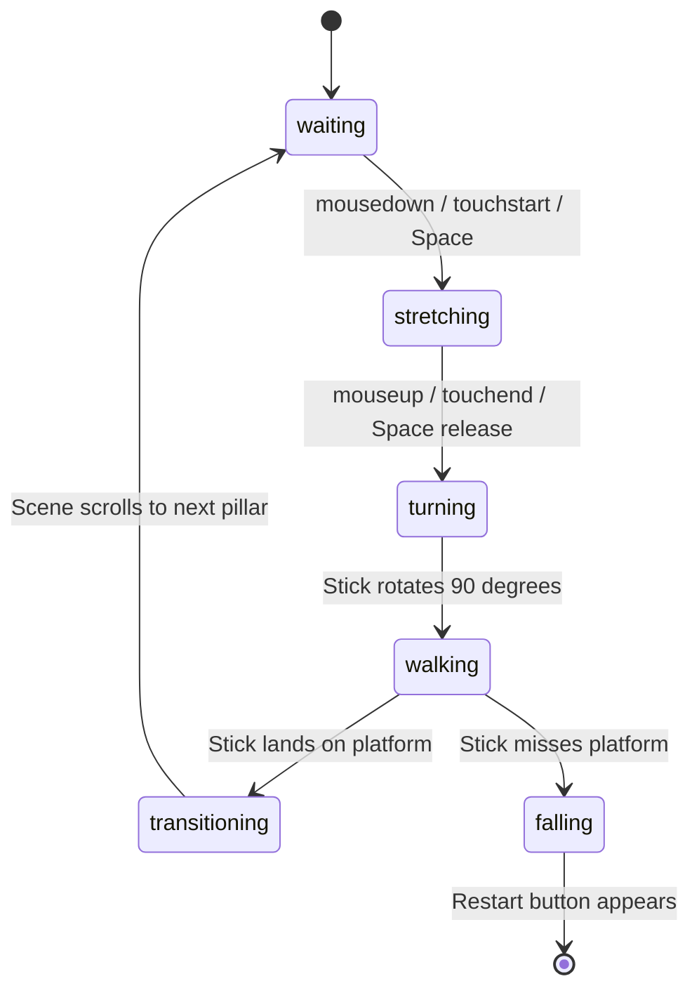

# Stick Hero (Stick Man)

A classic physics-inspired stick bridge arcade game built with HTML5 Canvas and Vanilla JavaScript.

[Screenshots](#screenshots--gameplay) • [Features](#features) • [How to Play](#how-to-play) • [Quick Start](#quick-start) • [Architecture](#architecture)

---

## Screenshots & Gameplay

<div align="center">

### 1. Waiting at the Edge
*Hold down the mouse, spacebar, or tap on mobile to stretch out the stick.*


---

### 2. Precision Stretching
*Gauge the distance to the next pillar. If the stick is too short or too long, the hero falls.*


---

### 3. Crossing the Bridge
*Landing directly on the red center marker awards a DOUBLE SCORE bonus.*


---

### 4. Game Over & Restart
*Click the restart button or tap spacebar to immediately play again.*


</div>

---

## Features

- **Physics & Canvas Mechanics**: Procedural trigonometric hills, procedural tree placement, 90-degree lowering rotation, and falling animations.
- **Double Score Target Zone**: Landing the bridge on the red center spot gives double points with visual feedback.
- **Cross-Platform Controls**: Responsive canvas scaling with full touch support on phones and tablets (`touchstart`, `touchend`), as well as mouse and keyboard (`Spacebar`).
- **High Score Tracking**: Best score is saved locally via browser `localStorage`.
- **Zero Dependencies**: Pure HTML5, CSS3, and JavaScript without build tools or external packages needed.

---

## How to Play

| Control | Action |
| :--- | :--- |
| **Mouse Left-Click (Hold)** | Grow stick upwards |
| **Mouse Left-Click (Release)** | Drop stick onto next platform |
| **Spacebar (Hold & Release)** | Keyboard control to stretch and drop |
| **Touch Screen (Hold & Release)**| Stretch and drop on mobile and tablet devices |
| **Restart Button / Spacebar** | Restart game after falling |

### Tips
1. Sticks grow at a steady rate of 1 pixel every 4 milliseconds.
2. Aim for the red center marker on the next pillar to double your points.
3. Don't overstretch; if the stick extends past the platform, you will fall.

---

## Quick Start

### Run in Browser
Clone the repository and open `index.html` in any browser:

```bash
git clone https://github.com/Sunil56224972/stick-man.git
cd stick-man
```

Open `index.html` directly in your browser.

### Local Development Server
Alternatively, start the included lightweight server:

```bash
npm start
```

Then navigate to `http://localhost:8089`.

---

## Project Structure

```text
stick-man/
├── index.html        # Main HTML5 game entry point
├── style.css         # UI stylesheet and responsive layout
├── script.js         # Canvas engine, state machine, and gameplay logic
├── package.json      # Project metadata and start script
├── server.js         # Zero-dependency local development server
├── .gitignore        # Git ignore file
├── screenshots/      # Gameplay screenshots
│   ├── gameplay.png
│   ├── stretching.png
│   ├── walking.png
│   └── gameover.png
└── README.md         # Documentation
```

---

## Architecture

The gameplay lifecycle is managed as a finite state loop:



---

## Contributing

Contributions, bug reports, and suggestions are welcome. Feel free to open an issue or submit a pull request.

1. Fork the repository
2. Create a branch (`git checkout -b feature/improvement`)
3. Commit your changes (`git commit -m 'Add improvement'`)
4. Push to your branch (`git push origin feature/improvement`)
5. Open a Pull Request

---

## License

This project is licensed under the MIT License.
