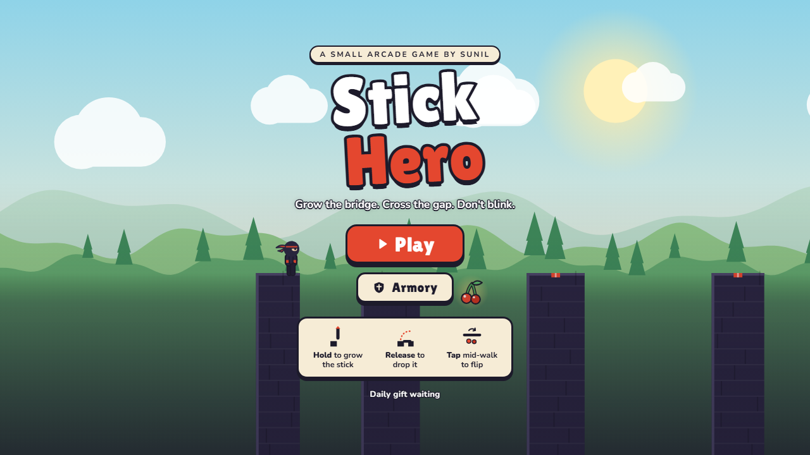
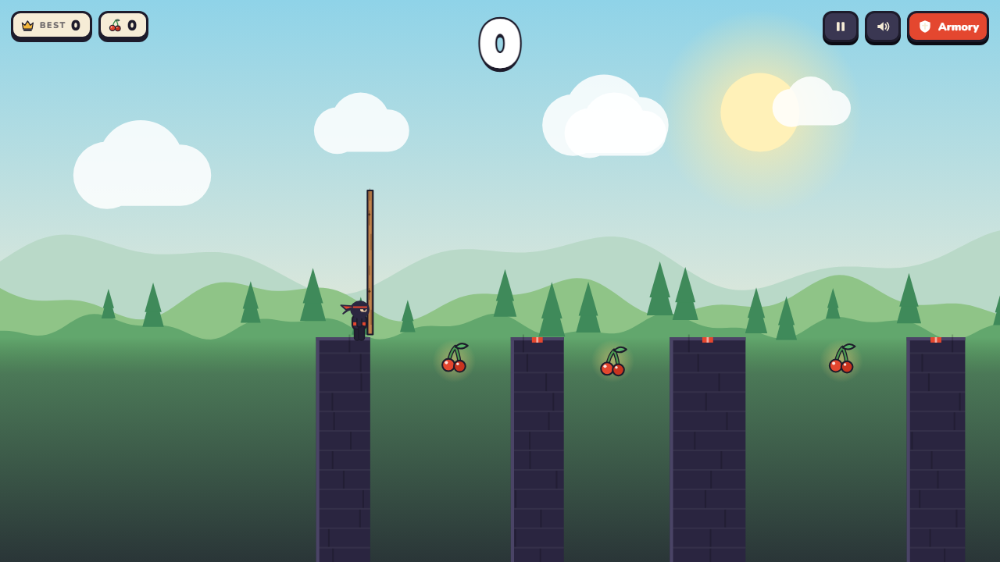
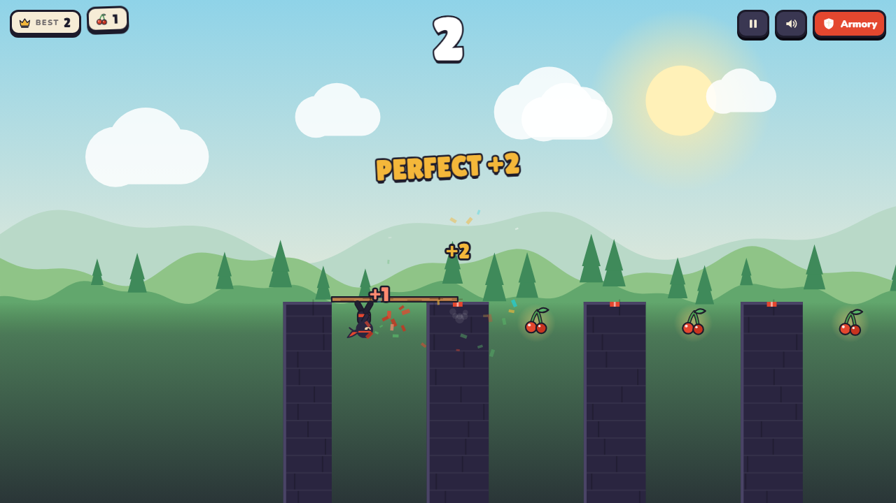
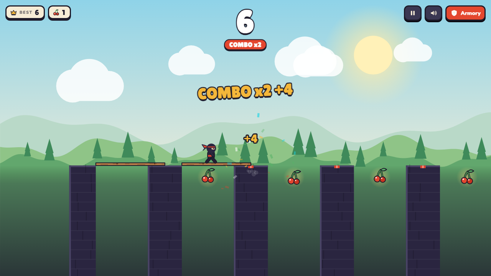
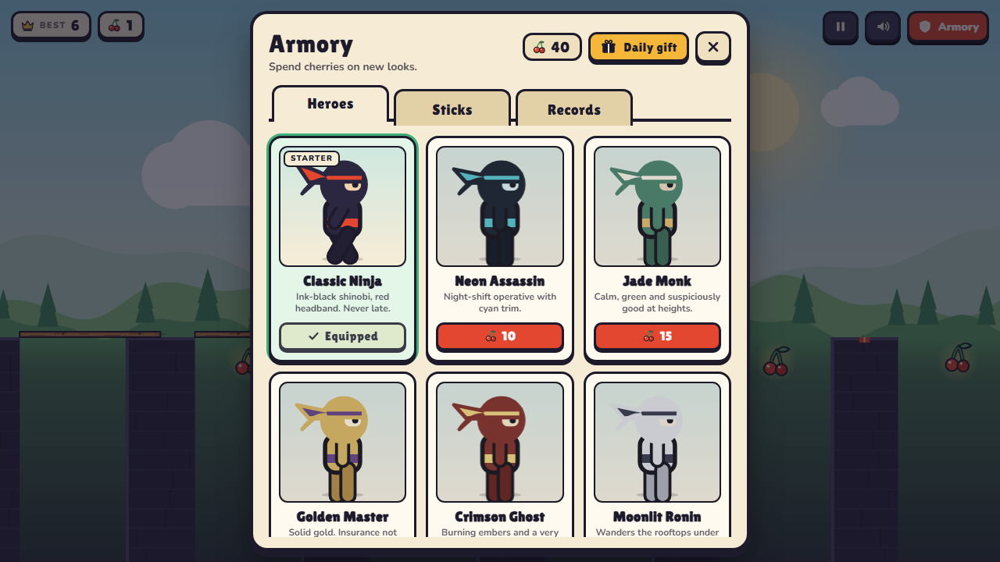
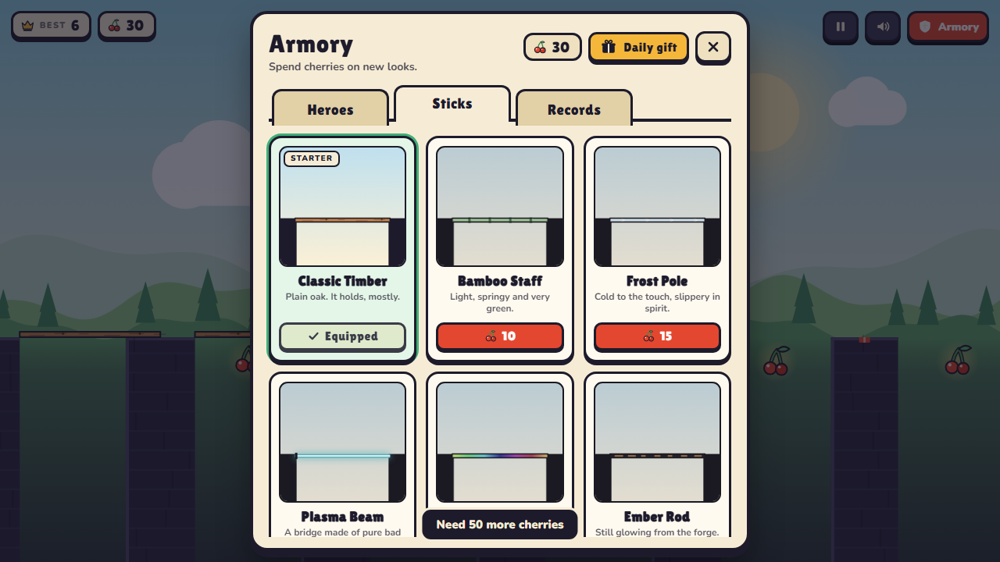
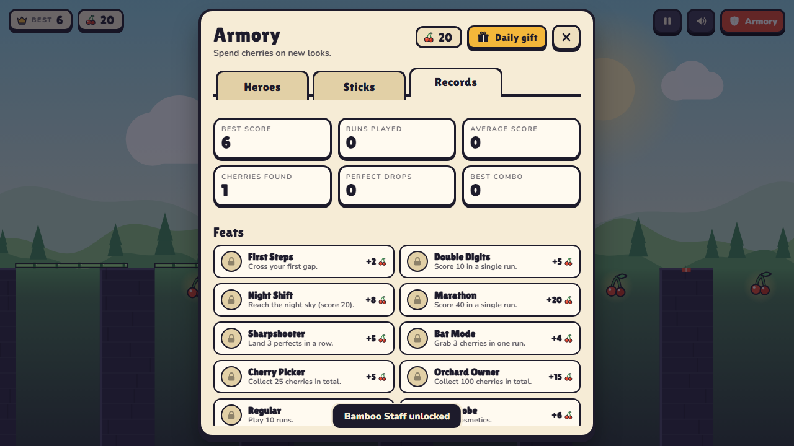
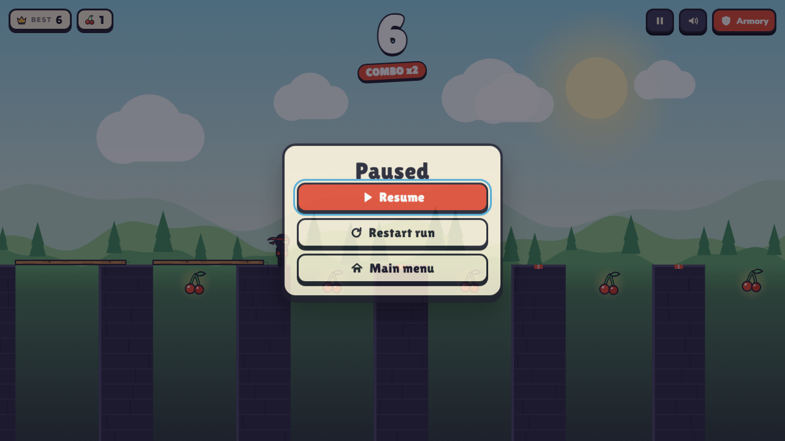
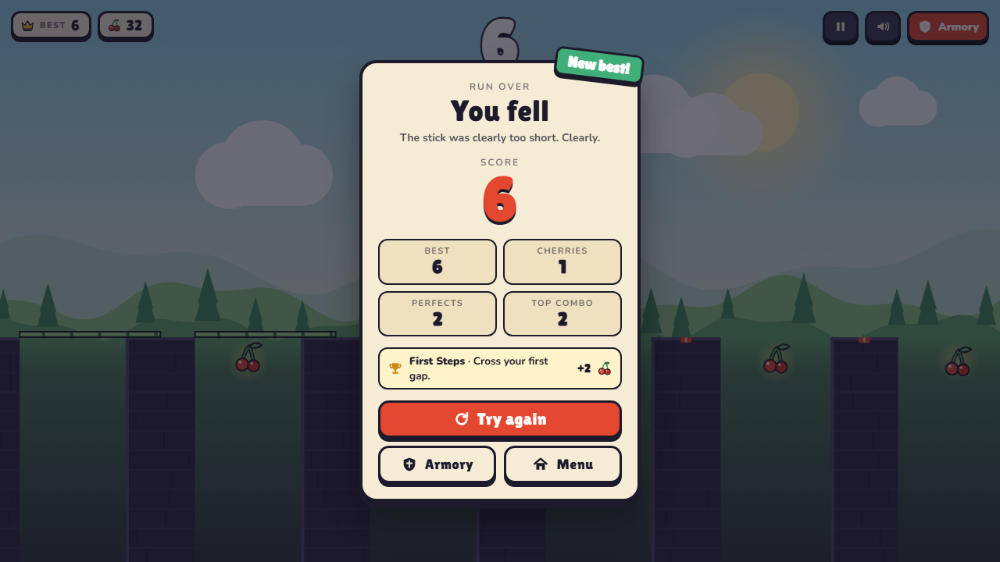
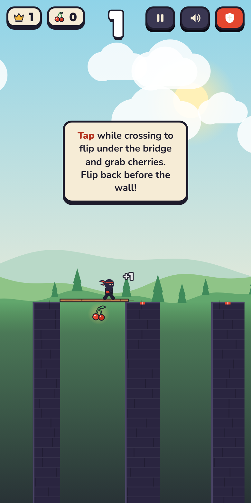

# Stick Hero

A hand-drawn arcade bridge game. Hold to grow a stick, release to drop it, and walk across. Miss the gap and you fall. Built with plain HTML5 Canvas and vanilla JavaScript: no frameworks, no bundler, no build step.



## Features

- Hold-and-release bridge mechanic with a difficulty curve that tightens gaps and narrows pillars as your score climbs.
- Mid-walk gravity flip: tap while crossing a gap to hang under the stick and grab cherries.
- Perfect drops on the red target pillar marker, with a combo multiplier.
- Armory with 6 heroes and 6 stick styles, each with a rarity tier, all drawn in code (no image assets).
- 10 feats that pay out cherries, a Records tab with lifetime stats, and a daily gift with a streak bonus.
- Day, dusk and night sky that blends as you progress, with parallax hills and pines.
- Fully synthesised soundtrack of effects, no audio files: a creaking bamboo stick that rises in pitch as it grows, wood-on-stone knocks, alternating footsteps, taiko impacts and koto-style plucks. Everything is tuned to one pentatonic scale, perfect combos climb it, and a temple bell marks dusk and night. Mute with the speaker button or `M`.
- Works with mouse, touch and keyboard. Layout adapts to phones and short landscape windows.
- Versioned save in `localStorage`, with migration from the previous release's keys.

## Screenshots

| Growing a bridge | Gravity flip | Perfect drop |
| --- | --- | --- |
|  |  |  |

| Armory: heroes | Armory: sticks | Records and feats |
| --- | --- | --- |
|  |  |  |

| Pause | Game over | Mobile |
| --- | --- | --- |
|  |  |  |

## Controls

| Action | Mouse / touch | Keyboard |
| --- | --- | --- |
| Grow the stick | Press and hold | Hold `Space` or `Enter` |
| Drop the stick | Release | Release `Space` or `Enter` |
| Flip while crossing | Click or tap | `Space` or `Enter` |
| Pause / resume | Pause button | `P` or `Esc` |
| Mute / unmute | Speaker button | `M` |
| Open the armory | Armory button | `A` |

## Rules

- A landing scores 1 point. A perfect drop (stick tip on the red marker) scores `combo x 2`, and the combo grows with each consecutive perfect.
- Flipping is only allowed while you are over a gap. Arriving at a pillar upside down crashes into it.
- Cherries hang beneath wide gaps (80 px or more). You can only collect them while flipped.
- The sky changes at scores 10 (dusk) and 20 (night).
- The daily gift pays 10 cherries plus 2 per streak day, capped at 22.

## Run locally

Requires Node.js 18 or newer. There are no dependencies to install.

```bash
npm start
```

Then open <http://localhost:8089>. The server only serves the `public/` folder and rejects path traversal. Any static host works too, since the game is just files.

## Tests

```bash
npm test          # 33 unit tests for the game simulation, storage and catalog
npm run test:e2e  # 57 browser checks (needs the server running and Playwright)
```

The end-to-end suite drives the real UI: starting a run, holding and releasing, flips, cherries, pause, game over, persistence, reset and a phone-sized viewport. It also fails on any console error. It reads Playwright from `PLAYWRIGHT_PATH` if set, and regenerates the images in `docs/screenshots/`.

## Project structure

```text
public/
  index.html        markup, SVG icon sprite, all screens
  css/style.css     paper-cut UI theme
  assets/           self-hosted fonts and favicon
  js/
    game.js         simulation: physics, rules, difficulty (no DOM, no canvas)
    renderer.js     canvas scene: sky, parallax, pillars, particles, shake
    draw.js         hero, stick and cherry drawing helpers
    catalog.js      heroes, sticks, feats, rarity
    storage.js      versioned save, migration, daily gift
    audio.js        Web Audio sound synthesis
    ui.js           HUD, armory, toasts, dialogs
    main.js         input, game loop, wiring
server.js           tiny static file server
tests/              unit and end-to-end suites
```

The simulation in `game.js` is pure logic that emits events (`perfect`, `flip`, `cherry`, `crash`, ...). `main.js` translates those into sound, UI updates and screen shake, and `renderer.js` only reads game state. That split is what lets the unit tests run in plain Node.

## Deploy

The repo includes a `vercel.json` that publishes `public/` with clean URLs. On Vercel, import the repository and keep the defaults. GitHub Pages or Netlify work the same way by pointing them at `public/`.

## License

MIT, see [LICENSE](LICENSE). Made by [Sunil](https://github.com/Sunil56224972).