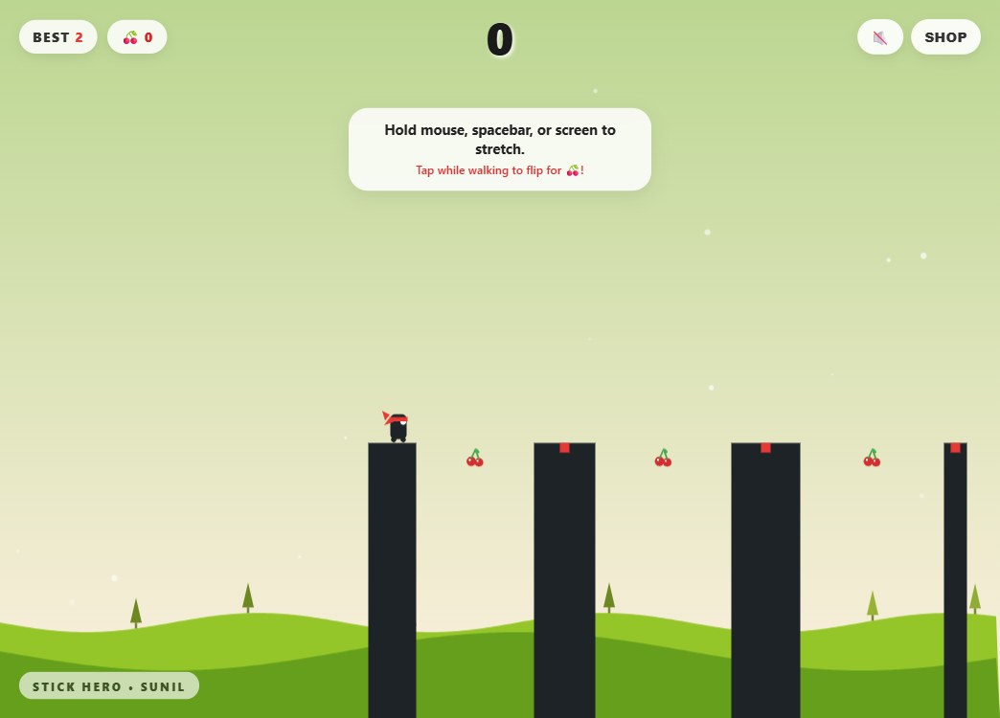
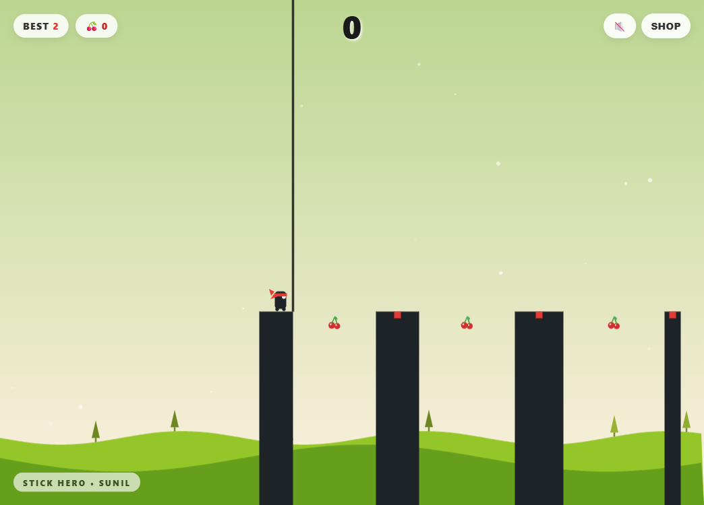
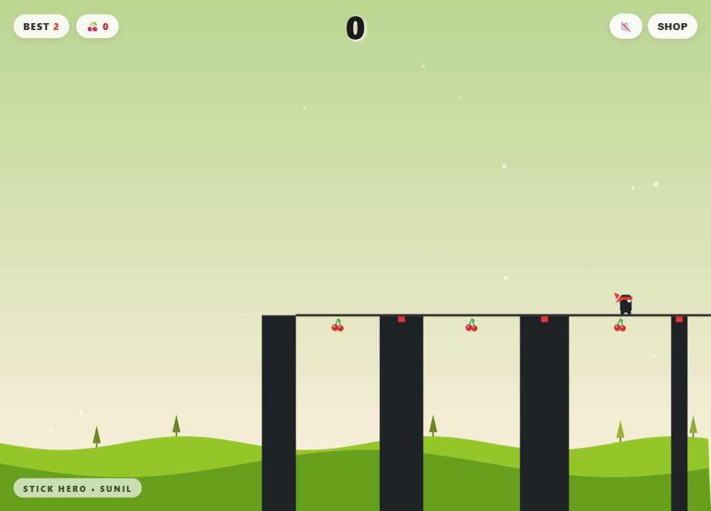
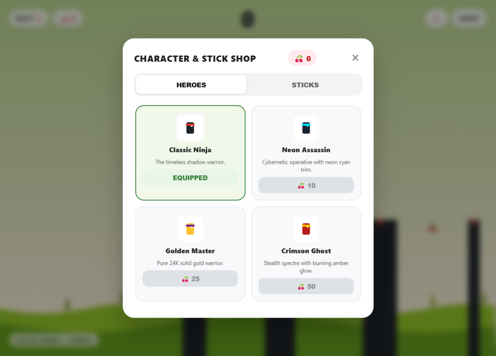
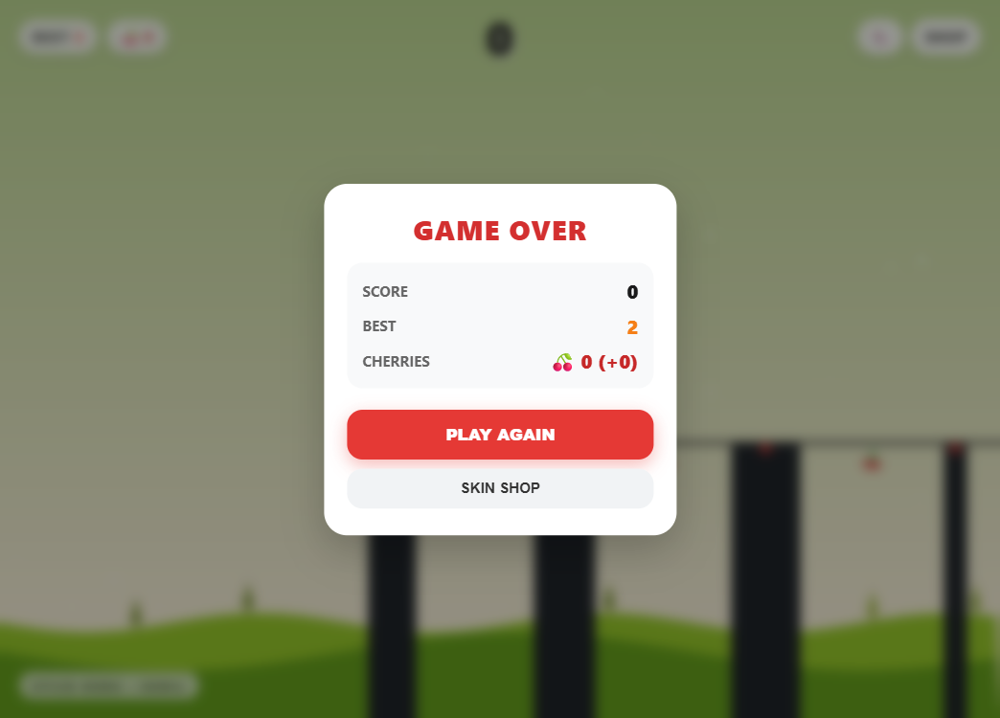
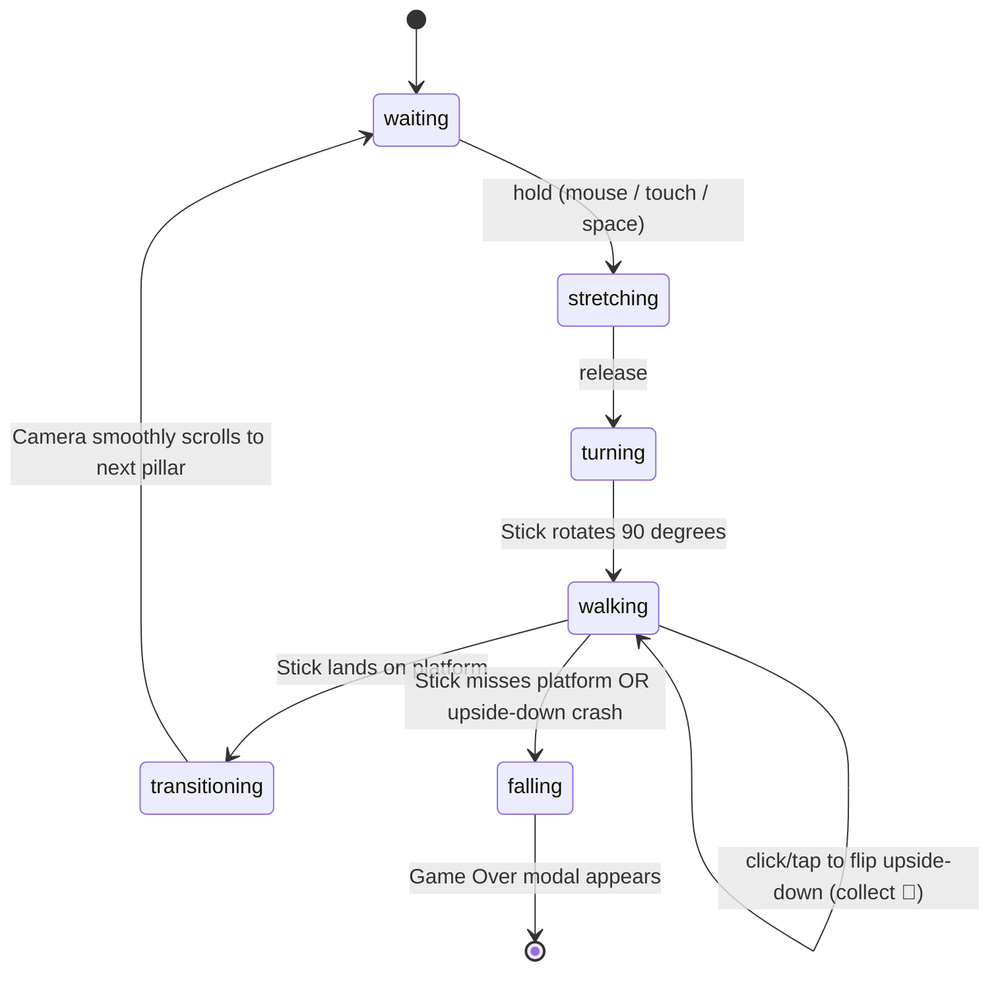

# Stick Hero (Stick Man)

A feature-packed, physics-based stick bridge arcade game built with HTML5 Canvas and Vanilla JavaScript.

[Screenshots](#screenshots--gameplay) • [Features](#features) • [How to Play](#how-to-play) • [Skin Shop](#skin-shop) • [Quick Start](#quick-start) • [Architecture](#architecture)

---

## Screenshots & Gameplay

<div align="center">

### 1. Waiting at the Edge
*Hold down the mouse, spacebar, or tap on screen to stretch out the stick.*



---

### 2. Precision Stretching
*Gauge the distance to the next pillar. If the stick is too short or too long, the hero falls.*



---

### 3. Crossing the Bridge & Cherry Collection
*Landing directly on the red center marker awards combo points. Tap while crossing to hang upside down and snatch cherries!*



---

### 4. Character & Stick Skin Shop
*Spend your hard-earned cherries to unlock custom ninja costumes and special stick weapons.*



---

### 5. Game Over & Instant Restart
*View your score breakdown and cherries collected, with instant restart or shop access.*



</div>

---

## Features

- **Upside-Down Cherry Mechanic**: Cherries randomly spawn hanging underneath bridges. Tap or click while walking to flip upside down and collect them, but flip back upright before you crash into the next pillar!
- **Web Audio Synthesizer**: Zero-dependency 8-bit sound effects synthesized on the fly via the HTML5 `AudioContext` (stretch pitch-ramp, plank drop, footsteps, flip whoosh, cherry ding, combo chimes, and fall slides), with a persistent mute button.
- **Character & Stick Skin Shop**:
  - **Hero Outfits**: Classic Ninja, Neon Assassin, Golden Master, and Crimson Ghost.
  - **Stick Styles**: Classic Timber, Bamboo Staff, Cyan Lightsaber, and Rainbow Prism.
  - All unlocks and active equipment persist in browser `localStorage`.
- **Dynamic Day / Sunset / Night Theme Engine**:
  - **Day (Score 0-9)**: Gentle sunny pastel gradient with green hills and floating drift particles.
  - **Sunset (Score 10-19)**: Rich orange-amber twilight with a radiant sun and dusk hills.
  - **Midnight (Score 20+)**: Deep starry space with a glowing crescent moon and twinkling stars.
- **Combo Streak & Particle Explosions**:
  - Landing dead-center on the red target grants consecutive multipliers (`PERFECT +2`, `COMBO x2 +4`, `COMBO x3 +6`...).
  - Confetti bursts, sparkle effects, and floating floating point indicators on canvas.
- **Full Cross-Platform & Touch Support**:
  - Play on desktop (mouse & Spacebar) or mobile/tablet (touch & hold).
  - Responsive canvas scaling adapting seamlessly to any screen size.
- **High Score & Cherries Persistence**: Automatically tracks your best score and cherry balance in `localStorage`.
- **Zero Build Tools or Heavy Dependencies**: Runs directly in any browser out of the box.

---

## How to Play

| Control | Action |
| :--- | :--- |
| **Mouse Left-Click / Touch / Spacebar (Hold)** | Grow stick upwards |
| **Mouse Left-Click / Touch / Spacebar (Release)** | Drop stick onto next platform |
| **Click / Tap / Spacebar (While Walking)** | **Flip upside down** to grab cherries (tap again to flip upright) |
| **Speaker Button (🔊 / 🔇)** | Toggle audio sound effects |
| **SHOP Button** | Open character & stick customization store |
| **Restart Button / Spacebar** | Restart game after falling |

### Pro Tips
1. **Cherries Risk vs Reward**: Hanging upside down is the only way to collect cherries, but if you don't flip upright before the next platform edge, you will collide with the pillar!
2. **Aim for the Red Target**: Hitting consecutive red markers chains combos for massive score multipliers.
3. **Patience & Rhythm**: Sticks stretch at a consistent rate of 1 pixel every 4 milliseconds.

---

## Skin Shop

Collect cherries while playing to unlock skins:

### Heroes
- **Classic Ninja** (Unlocked by default)
- **Neon Assassin** (10 Cherries)
- **Golden Master** (25 Cherries)
- **Crimson Ghost** (50 Cherries)

### Sticks
- **Classic Timber** (Unlocked by default)
- **Bamboo Staff** (10 Cherries)
- **Cyan Lightsaber** (25 Cherries)
- **Rainbow Prism** (50 Cherries)

---

## Quick Start

### Run in Browser
Clone the repository and open `index.html` in any browser:

```bash
git clone https://github.com/Sunil56224972/stick-man.git
cd stick-man
```

Double click `index.html` to play immediately!

### Local Development Server
Or start the included lightweight server:

```bash
npm start
```

Then visit `http://localhost:8089`.

---

## Project Structure

```text
stick-man/
├── index.html        # Main HTML5 game entry point with HUD and Modals
├── style.css         # UI stylesheet, glassmorphism HUD, shop grid, responsive layout
├── script.js         # Canvas engine, Web Audio synth, state machine, particle FX
├── package.json      # Project metadata and start script
├── server.js         # Zero-dependency local development server
├── .gitignore        # Git ignore file
├── screenshots/      # Gameplay screenshots
│   ├── gameplay.png
│   ├── stretching.png
│   ├── walking.png
│   ├── shop.png
│   └── gameover.png
└── README.md         # Comprehensive documentation
```

---

## Architecture

The gameplay lifecycle is managed through a finite state loop:



---

## Contributing

Contributions, bug reports, and suggestions are welcome. Feel free to open an issue or submit a pull request.

1. Fork the repository
2. Create a branch (`git checkout -b feature/improvement`)
3. Commit your changes (`git commit -m 'Add improvement'`)
4. Push to your branch (`git push origin feature/improvement`)
5. Open a Pull Request

---

## Author

Developed and maintained by **[Sunil](https://github.com/Sunil56224972)**.

---

## License

This project is licensed under the MIT License.
